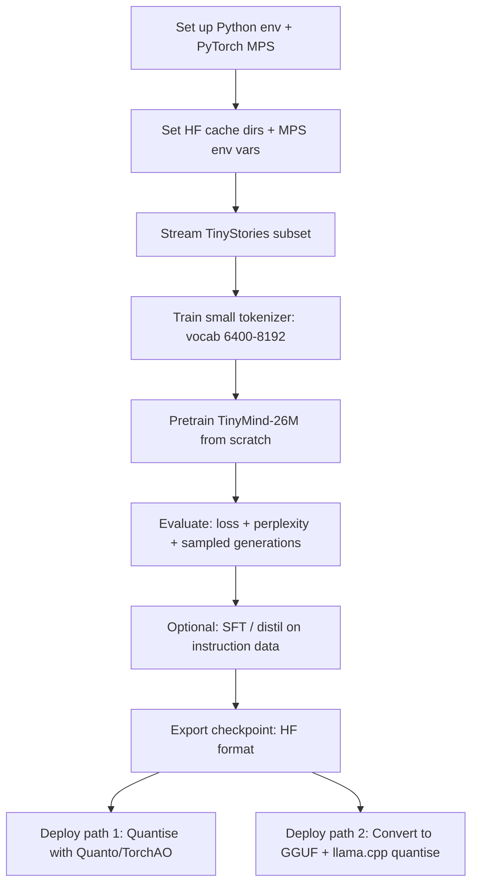

# Building a 20–30M Parameter LLM on a Mac: Feasibility and an Improved MiniMind-Based Plan

## Executive summary

With **24 GB RAM** and **~30–40 GB free disk**, you *can* train a **tiny (20–30M parameter) decoder-only Transformer** from scratch on your Mac—**if you keep the dataset modest (e.g., TinyStories), use streaming or light caching, and design for the constraints of Apple’s Metal/MPS backend**. The result can be a coherent “toy” language model (especially for story-like English), but it will not be comparable in capability to large generalist models; its strengths will depend heavily on dataset scope and instruction-tuning. citeturn28search0turn28search2turn17search2turn20view0turn19search2

This report proposes an improved plan “based on minimind but better” by (i) **targeting 20–30M params explicitly**, (ii) using a **Mac-first training loop that works on MPS** (including fallback/watermark controls), (iii) using **Hugging Face datasets streaming + reproducible preprocessing**, and (iv) saving **Hugging Face–compatible checkpoints** so you can deploy via **llama.cpp / GGUF** or via PyTorch quantisers like **Optimum Quanto**. citeturn12search5turn15view1turn0search6turn19search2turn23search1turn9search0

Key takeaways:

- **Training-from-scratch is realistic** for 20–30M params on TinyStories-scale corpora (TinyStories data is ~2.14M rows and advertised as ~1 GB for downloaded files; it is specifically designed so small LMs can learn fluent story English). citeturn28search2turn0search1turn28search0turn28search16  
- On macOS, **MPS is single-device** (no multi-GPU distributed), and some ops may fall back to CPU; plan for this explicitly with environment variables and conservative batch sizing. citeturn8search1turn17search2turn19search2turn8search17  
- A **MiniMind-like modern block** (RoPE + RMSNorm + SwiGLU + GQA) is an excellent fit for the parameter budget and for inference efficiency. This is also exactly the direction MiniMind takes in its reference implementation. citeturn4view0turn5view0turn4view1turn6search1turn6search2turn6search3turn7search0  
- For deployment, you have two robust options on Mac:  
  - **GGUF/llama.cpp** (fast local inference; Metal-supported builds on macOS) citeturn25view0turn23search1turn23search9  
  - **PyTorch quantisation** (Optimum Quanto / TorchAO; device-agnostic; integrates with Transformers) citeturn9search0turn9search1turn9search24  

## Assumptions and Mac hardware constraints

### Explicit assumptions

- **No external cloud**; everything runs locally.  
- **GPU availability unknown**: if unspecified, assume an entity["company","Apple","hardware maker"] silicon Mac with an integrated GPU (Metal) and unified memory; however, Intel + AMD macOS setups are also possible. Metal + MPS apply in both Apple Silicon and some AMD GPU Mac configurations. citeturn27view0turn17search3turn17search10  
- macOS version is **not stated**: MPS acceleration for PyTorch requires **macOS 12.3+** and the Apple documentation recommends using recent PyTorch (often nightly/preview) for the newest MPS improvements. citeturn27view0  

### What your 24 GB RAM and 30–40 GB disk imply

**RAM / unified memory.** Training uses much more than “model weights”: mixed-precision training with AdamW is often estimated at **~18 bytes/parameter** *plus activations* (forward activations depend on seq_len × batch × hidden size). For a 20–30M model, parameter-state memory is not the bottleneck (hundreds of MB), but *activations and temporary buffers* can dominate—especially with longer context and larger batches. citeturn20view0  

**Disk.** TinyStories is feasible within your free disk budget (dataset pages show ~2.14M rows; the dataset “data” tree shows ~1 GB). citeturn28search2turn28search16turn0search1  
But larger corpora like OpenWebText can exceed your disk if you fully materialise them: one OpenWebText dataset card reports **~55 GB total disk used** if fully downloaded + processed. This effectively forces you to either (i) use streaming, (ii) use very small subsets, or (iii) store caches on an external drive. citeturn16search2turn0search6turn0search31  

### MPS-specific constraints you must design around

- **Single-device only**: Accelerate notes that `gloo`/`nccl` distributed backends don’t work with `mps`, so you should assume **single-GPU training only** on MPS. citeturn8search1turn17search2  
- **Fallback and memory watermark**: PyTorch documents MPS environment variables, including:
  - `PYTORCH_ENABLE_MPS_FALLBACK=1` (CPU fallback for unsupported ops)  
  - `PYTORCH_MPS_HIGH_WATERMARK_RATIO` as a hard allocation limit; `0.0` disables the limit but “may cause system failure” if you hit system-wide OOM. citeturn19search2  
- **Precision reality**: MiniMind defaults to `bfloat16` for training, but bfloat16 support on MPS has historically been incomplete/variable; Apple has discussed bfloat16 at the Metal/MPSGraph level, but PyTorch issues and user reports show bf16 on MPS can still be problematic depending on version/hardware. A safe Mac-first plan should default to **float16 autocast on MPS**, with bf16 as an optional “if it works on your setup” switch. citeturn15view1turn8search20turn8search0turn8search16  

## Recommended 20–30M model design

### Why a MiniMind-like block is the right “tiny LLM” target

MiniMind’s reference model is already a modern decoder-only design: it uses **RoPE**, **RMSNorm**, **(Swi)GLU-style gated MLP**, and **grouped-query attention (GQA)** via `num_key_value_heads`, with optional fast attention through PyTorch’s `scaled_dot_product_attention`. citeturn4view0turn5view0turn4view1turn3view3  
Those choices are backed by primary literature:
- Transformer backbone: “Attention Is All You Need.” citeturn6search0  
- RoPE: “RoFormer: Rotary Position Embedding.” citeturn6search1  
- RMSNorm: “Root Mean Square Layer Normalization.” citeturn6search2  
- GLU variants (incl. SwiGLU): “GLU Variants Improve Transformer.” citeturn6search3  
- GQA: “GQA: Training Generalized Multi-Query Transformer Models…” citeturn7search0  

### Exact recommended model target

For your Mac constraints, the best “sweet spot” is **~26M parameters** (centre of your 20–30M range) with a conservative context length and a small vocabulary, because embeddings can dominate in tiny models.

MiniMind’s own repo claims a “~25.8M” smallest model, trained from scratch quickly on consumer hardware, which aligns well with your stated goal. citeturn12search5turn11view1  

I recommend this **26M-class “TinyMind-26M” config** (LLaMA-style block, MiniMind-inspired, optimised for small-scale training):

- **Architecture**: decoder-only Transformer (causal LM). citeturn6search0  
- **Layers (`n_layer`)**: 8  
- **Model width (`d_model`)**: 512  
- **Attention heads**: 8  
- **KV heads (GQA)**: 2 (4 query heads share 1 KV head) citeturn7search0turn4view0  
- **Head dim**: 64  
- **MLP / FFN (`d_ff`)**: 1408 (≈ 8/3 × 512, rounded; matches MiniMind’s internal default sizing rule) citeturn4view1  
- **Activation**: SiLU + gated MLP (SwiGLU-like) citeturn6search3turn4view1  
- **Normalisation**: RMSNorm (pre-norm) with `eps=1e-5` citeturn6search2turn4view0  
- **Positional encoding**: RoPE; set `rope_theta ≈ 1e6` as MiniMind does (helps longer-context extrapolation in some modern families, though you will train at shorter seq_len). citeturn6search1turn4view4  
- **Dropout**: 0.0–0.1 (TinyStories is synthetic/clean; dropout can help but also slow convergence—tune)  
- **Vocabulary size**: 6,400 or 8,192.  
  - MiniMind uses **6,400** with ByteLevel BPE. citeturn10view1turn22view1turn4view0  
  - For TinyStories specifically, 6.4k is usually adequate because the dataset is designed around a small vocabulary. citeturn28search0turn28search5  

### Two nearby variants you can run on the same Mac

- **TinyMind-20M (faster, cheaper)**: 8 layers, `d_model=448`, heads=8, kv_heads=2, `d_ff≈1216`, vocab=6.4k–8k  
- **TinyMind-30M (best quality within budget)**: 9 layers, `d_model=512`, heads=8, kv_heads=2, `d_ff=1408`, vocab=6.4k (or keep 8 layers and slightly raise vocab/width)

The design space is flexible because RoPE/RMSNorm/SwiGLU/GQA are parameter-light compared with embeddings and MLP matrices, so you mainly trade off **depth, width, and vocab size**.

### Memory and disk estimates for 20M and 30M variants

Below are practical, order-of-magnitude estimates **excluding activation memory**, derived from Hugging Face’s “model training anatomy” breakdown (weights, optimiser state, gradients) and standard byte/parameter accounting. citeturn20view0  

| Component | Rule of thumb | 20M params | 30M params |
|---|---:|---:|---:|
| Weights (fp16) | ~2 bytes/param | ~38 MB | ~57 MB |
| AdamW optimiser states (m,v in fp32) | ~8 bytes/param | ~153 MB | ~229 MB |
| Gradients (fp32) | ~4 bytes/param | ~76 MB | ~114 MB |
| **Training param-states total** (mixed precision AdamW) | **~18 bytes/param** | **~343 MB** | **~515 MB** |
| “Weights-only” checkpoint (fp16) | ~2 bytes/param | ~38 MB | ~57 MB |
| Resume checkpoint (fp16 weights + fp32 Adam states) | ~10 bytes/param | ~191 MB | ~286 MB |

In practice on MPS, you must still budget for:
- **activations** (often the real memory driver at seq_len ≥ 512)  
- **temporary buffers** and framework overhead citeturn20view0turn19search2  

## Pipeline A: training from scratch on TinyStories

### Data sources that fit your disk budget

**Primary pretraining corpus (recommended):**
- TinyStories dataset on entity["company","Hugging Face","ml platform"]: ~2,141,709 rows; its “data” artefacts are shown as ~1 GB, and it is explicitly designed so small language models can learn coherent English. citeturn28search2turn28search16turn0search1turn28search0  
- The TinyStories paper explains it is synthetic story data generated by GPT-3.5 and GPT-4, using a limited-childlike vocabulary. citeturn28search0turn28search5turn28search12  

**Optional add-ons (small, high-quality, still feasible):**
- WikiText-2 raw: very small on disk (tens of MB). Use for “out-of-domain” perplexity sanity checks. citeturn16search4turn21search11  
- BookCorpusOpen (~3.94 GB download): optional if you can spare disk and want longer-form text; for your free disk, treat this as optional and consider streaming/subsampling. citeturn16search3  
- OpenWebText: **not feasible to fully download** under your disk budget (one commonly used dataset card reports ~55 GB total disk used); only use via **streaming** or tiny subsets. citeturn16search2turn16search6  

### Streaming vs local caching on Hugging Face Datasets

- Hugging Face Datasets supports **streaming mode** via `load_dataset(..., streaming=True)`, and the streaming guide explains how to use it. citeturn0search6  
- A Hugging Face forum answer explicitly notes that **streaming does not cache the dataset locally** and “loads it directly in memory at iteration time” (good for small disks). citeturn0search13  
- Streaming shuffling is buffer-based; `IterableDataset.set_epoch()` exists to reshuffle per epoch. citeturn0search23  

### Tokeniser choice and training

MiniMind uses a small **6,400 vocab** custom tokeniser and explicitly documents that choice; its training script uses **ByteLevel pre-tokenisation** plus **BPE**, with special tokens `"<|endoftext|>"`, `"<|im_start|>"`, `"<|im_end|>"`. citeturn10view1turn22view1turn4view0  

For an improved Mac-first plan:
- Keep **vocab ≤ 8k** to preserve your parameter budget (tiny models are sensitive to embedding size).
- Train the tokeniser on a reproducible subset (e.g., 100k–300k TinyStories examples) to keep preprocessing fast.
- Prefer ByteLevel+BPE for robustness on arbitrary text, consistent with MiniMind’s educational goal; alternatively, Transformers also provides an API to train a new tokeniser from an iterator. citeturn22view1turn18search7  

### Hyperparameters (full recommendations) with rationale

These values are chosen to be **stable on MPS**, avoid OOM, and match compute-optimal intuition in the small regime:

**Sequence length (`seq_len`)**: 256 or 512  
- 512 improves narrative coherence; 256 is much easier on memory and often faster on MPS. (Start at 256; scale up once stable.)

**Microbatch size (per step)**: start 4–8 on MPS  
- Increase until you hit memory pressure; then use grad accumulation.

**Gradient accumulation**: 8–32  
- Lets you reach an effective batch size without increasing activation memory.

**Effective batch target (sequences per optimiser step)**: ~128 sequences (good starting point)  
- Example: microbatch=8, grad_accum=16 → effective batch=128.

**Optimiser**: AdamW  
- Hugging Face’s memory anatomy references AdamW state sizes and is the most common baseline. citeturn20view0  
- Suggested: betas=(0.9, 0.95), eps=1e-8, weight_decay=0.1, grad_clip=1.0 (MiniMind uses clip=1.0). citeturn15view1  

**Learning rate schedule**: warmup + cosine decay  
- The original Transformer paper uses warmup and decay; modern practice often uses cosine decay for stability. citeturn6search0  

**LR suggestion** (for ~26M model):
- peak LR: 3e-4 to 5e-4  
- warmup: 200–500 steps  
- min LR: 3e-5

**Total tokens**: 300M–600M tokens  
- Chinchilla’s compute-optimal findings suggest scaling training tokens roughly in proportion to parameters; the well-known 70B/1.4T example implies ~20× tokens/params as a useful heuristic. citeturn7search3  
- For 26M params, ~500M tokens is a practical “ambitious but plausible” target on a personal machine.

### Expected training time: tokens/sec and TFLOP scenarios

A common back-of-the-envelope for Transformer training compute is **~6 × parameter_count FLOPs per token**, discussed in the JAX scaling book. citeturn8search15  

Using that rule, purely compute-bound throughput is approximately:

- 20M params:  
  - 0.2 TFLOP/s sustained → ~1,667 tok/s  
  - 1.0 TFLOP/s sustained → ~8,333 tok/s  
- 30M params:  
  - 0.2 TFLOP/s sustained → ~1,111 tok/s  
  - 1.0 TFLOP/s sustained → ~5,556 tok/s  

For a 500M-token run, that corresponds roughly to:
- 20M params: ~83 h at 0.2 TF/s; ~17 h at 1 TF/s  
- 30M params: ~125 h at 0.2 TF/s; ~25 h at 1 TF/s  

**Reality check for Macs:** these are optimistic upper bounds. On MPS you may be bottlenecked by kernel maturity, memory bandwidth, dataloading/tokenisation, and temporary buffers; you should expect real tok/s to be lower, which is why the plan below includes a quick “measure tok/s” step early. citeturn20view0turn19search2turn17search2  

### Memory-saving techniques you should enable immediately

- **Activation / gradient checkpointing** trades extra compute for lower memory. The foundational idea is described in “Training Deep Nets with Sublinear Memory Cost,” and PyTorch documents its checkpoint mechanism. citeturn19search0turn19search1  
- **Disable KV cache during training** (it is for inference).  
- Prefer **float16 autocast on MPS** (bf16 optional). PyTorch AMP mechanics are documented in its AMP docs, and Apple highlights mixed precision support for PyTorch/Metal in WWDC material. citeturn8search12turn8search20  

## Pipeline B: fine-tune and distillation for instruction-following behaviour

A 20–30M model *can* be instruction-tuned, but you should be realistic: it will follow short instructions and produce short answers in-domain; it will not become a strong general assistant.

### Two practical “teacher” strategies without cloud

**Offline distillation via existing synthetic instruction datasets (recommended):**
- **Alpaca** (52k instruction-response pairs) is explicitly described as generated using an OpenAI model and based on the Self-Instruct pipeline; this is a direct distillation-style dataset. citeturn26search0turn26search2  
- **Dolly 15k** is a smaller human-generated instruction dataset. citeturn26search1turn26search9  
- **TinyStoriesInstruct** exists but is *huge* (tens of millions of rows), so you must sample/stream. citeturn28search1turn28search3  

**Local teacher generation (optional, slower):**
- Run a quantised teacher locally via llama.cpp (Metal build on macOS) and generate your own instruction-response pairs for your target style/domain; then supervise-train (SFT) your tiny model on that data. citeturn25view0turn23search9turn23search1  

### Fine-tuning strategies that make sense at 20–30M params

At this size you can **full fine-tune** (update all weights) without special tricks. Still, two approaches are worth considering:

- **Full-parameter SFT**: simplest, often best for small models; but can cause catastrophic forgetting if you overdo it.  
- **LoRA / QLoRA-style PEFT**: typically used for large models, but still valuable if you want to preserve the base model and keep “personality” tuning separate. LoRA is defined in the LoRA paper. citeturn7search1turn18search6  
  - On Mac, classic bitsandbytes has historically been problematic; however it now publishes macOS 14+ wheels (still noted as slow on MPS), and there are other Mac-friendly quantisation options (Quanto, TorchAO). citeturn9search3turn9search0turn9search1  

### Evaluation metrics and lightweight benchmarks

For tiny models, prioritise **fast, objective, local** evaluations:

- **Perplexity (PPL)** on held-out TinyStories + WikiText-2: Hugging Face documents PPL calculation caveats and usage. citeturn21search3turn16search4  
- **Qualitative sampling**: story prompts and short instruction prompts; this matters a lot at small scales.  
- Optional multiple-choice benchmarks (tiny models will be weak, but trends are informative):
  - HellaSwag (commonsense inference benchmark). citeturn21search0  
  - LAMBADA (broad context word prediction). citeturn21search1  
  - Use lm-evaluation-harness if you want standardised runs. citeturn21search2turn21search11  

## Toolchains, deployment options, and a minimal reproducible plan

### Mac-compatible toolchains and trade-offs

| Toolchain | Best for | Pros | Cons / gotchas |
|---|---|---|---|
| PyTorch + MPS | Training/fine-tuning on Apple silicon/AMD GPU Macs | Official Metal/MPS path; Apple provides setup guidance; supports `mps` device. citeturn27view0turn17search8 | Single-device; ops may be missing → CPU fallback; memory watermark tuning sometimes needed. citeturn8search1turn19search2turn8search17 |
| Transformers + Datasets (streaming) | Data pipeline + saving HF checkpoints | Streaming avoids huge downloads; standard formats; best ecosystem compatibility. citeturn0search6turn0search13turn0search31 | Streaming shuffle is approximate; tokenisation can bottleneck; cache paths must be managed on small disks. citeturn0search23turn0search31 |
| MLX / mlx-lm | Fine-tuning and inference on Apple silicon | Purpose-built for Apple silicon; mlx-lm supports LoRA/QLoRA and quantisation workflows. citeturn18search0turn18search1turn18search4 | Different ecosystem than PyTorch; weakest story for “train from scratch” reproducibility compared with standard Transformers pipelines. citeturn18search1turn18search0 |
| llama.cpp / GGUF | Fast local inference & distribution | Metal build enabled by default on macOS; easy FP16→Q4 quant pipelines; run models locally. citeturn25view0turn23search1turn23search9 | Conversion requires compatible HF layout and correct tokenizer packaging; quantisation trades quality for speed/size. citeturn23search13turn9search2 |
| Optimum Quanto | PyTorch quantisation (int8/int4) | Device-agnostic; integrated with Transformers; supports int4/int8 weight quantisation. citeturn9search0turn9search10 | Quantisation quality depends on calibration and layer exclusions; not the same runtime as GGUF/llama.cpp. citeturn9search17 |
| TorchAO | PyTorch-native quantisation/sparsity | Official PyTorch AO stack; quantise via `quantize_`. citeturn9search1turn9search8 | Rapidly evolving APIs; performance depends on backend coverage. citeturn9search1 |
| bitsandbytes (macOS) + alternatives | 8-bit optimiser / 4-bit quant fine-tuning | Now provides macOS 14+ wheels; but notes implementations are slow on MPS. citeturn9search3turn9search6 | For Mac, often prefer Quanto/TorchAO; community alternatives like mps-bitsandbytes exist but are not the canonical path. citeturn9search16turn9search3 |

### Minimal reproducible workflow diagram



### Step-by-step: run this on your Mac (no cloud)

This plan intentionally:
- stays within a **TinyStories-scale** dataset budget, citeturn28search2turn28search16  
- avoids common MPS pitfalls (fallback + memory watermark), citeturn19search2turn8search17  
- and produces a **Hugging Face–style checkpoint** you can convert to **GGUF** using llama.cpp. citeturn23search1turn25view0  

#### Environment setup

Apple’s Metal/PyTorch page provides an MPS-oriented setup and notes that you may want nightly builds for the latest MPS support; it also lists requirements and a verification script. citeturn27view0  

```bash
# 0) One-time system prereq (Apple recommends Xcode command-line tools)
xcode-select --install

# 1) Create an environment (conda recommended by Apple)
conda create -n tinymind python=3.11 -y
conda activate tinymind

# 2) Install PyTorch with newest MPS support (Apple suggests nightly/preview for latest MPS)
conda install pytorch torchvision torchaudio -c pytorch-nightly

# 3) Install the rest
pip install -U transformers datasets tokenizers accelerate safetensors evaluate numpy

# (Optional) For SentencePiece-based tokenizers you would also install:
# pip install -U sentencepiece
```

Set caches to a project directory so you don’t fill your system drive, consistent with Hugging Face cache environment variables. citeturn0search31turn0search9  

```bash
# From your project root:
export HF_HOME="$PWD/.hf"
export HF_HUB_CACHE="$HF_HOME/hub"
export HF_DATASETS_CACHE="$HF_HOME/datasets"
mkdir -p "$HF_HUB_CACHE" "$HF_DATASETS_CACHE"
```

MPS “safety knobs” (PyTorch documents these): citeturn19search2  

```bash
# If you hit missing-op errors on MPS, allow CPU fallback
export PYTORCH_ENABLE_MPS_FALLBACK=1

# If you hit MPS OOM due to the allocation watermark, you can tune this.
# WARNING: 0.0 disables the hard limit and may cause system failure if you truly OOM the machine.
# export PYTORCH_MPS_HIGH_WATERMARK_RATIO=0.0
```

#### Script: backend detection quick check

```bash
python - << 'PY'
import torch
print("torch:", torch.__version__)
print("mps available:", torch.backends.mps.is_available())
print("mps built:", torch.backends.mps.is_built())
device = "mps" if torch.backends.mps.is_available() else ("cuda" if torch.cuda.is_available() else "cpu")
print("selected device:", device)
PY
```

The Apple page shows essentially this `mps` verification pattern. citeturn27view0  

#### Script: train a MiniMind-style ByteLevel+BPE tokenizer on TinyStories

MiniMind’s tokenizer script is ByteLevel+BPE with vocab 6400 and special tokens; the script below mirrors that approach but streams TinyStories. citeturn22view1turn0search6turn0search13turn28search2  

Save as `train_tokenizer_tinystories.py`:

```python
import os
import json
from datasets import load_dataset
from tokenizers import Tokenizer, models, trainers, pre_tokenizers, decoders
from transformers import PreTrainedTokenizerFast

MODEL_DIR = "tinymind_tokenizer"
VOCAB_SIZE = 6400
NUM_STORIES_FOR_TOKENIZER = 200_000  # adjust (100k–300k is a good start)

SPECIAL_TOKENS = ["<|endoftext|>", "<|im_start|>", "<|im_end|>"]

def main():
    os.makedirs(MODEL_DIR, exist_ok=True)

    ds = load_dataset("roneneldan/TinyStories", split="train", streaming=True)
    ds = ds.shuffle(buffer_size=10_000, seed=42)

    def text_iterator():
        n = 0
        for ex in ds:
            yield ex["text"]
            n += 1
            if n >= NUM_STORIES_FOR_TOKENIZER:
                break

    tok = Tokenizer(models.BPE())
    tok.pre_tokenizer = pre_tokenizers.ByteLevel(add_prefix_space=False)

    trainer = trainers.BpeTrainer(
        vocab_size=VOCAB_SIZE,
        special_tokens=SPECIAL_TOKENS,
        show_progress=True,
        initial_alphabet=pre_tokenizers.ByteLevel.alphabet(),
    )
    tok.train_from_iterator(text_iterator(), trainer=trainer)
    tok.decoder = decoders.ByteLevel()

    # Enforce MiniMind-like IDs for consistency
    assert tok.token_to_id("<|endoftext|>") == 0
    assert tok.token_to_id("<|im_start|>") == 1
    assert tok.token_to_id("<|im_end|>") == 2

    tok.save(os.path.join(MODEL_DIR, "tokenizer.json"))

    hf_tok = PreTrainedTokenizerFast(
        tokenizer_file=os.path.join(MODEL_DIR, "tokenizer.json"),
        bos_token="<|im_start|>",
        eos_token="<|im_end|>",
        unk_token="<|endoftext|>",
        pad_token="<|endoftext|>",
    )
    hf_tok.save_pretrained(MODEL_DIR)

    # Helpful metadata for later
    with open(os.path.join(MODEL_DIR, "tokenizer_extra.json"), "w") as f:
        json.dump(
            {"vocab_size": VOCAB_SIZE, "num_stories": NUM_STORIES_FOR_TOKENIZER},
            f,
            indent=2,
        )

    print("Saved tokenizer to:", MODEL_DIR)

if __name__ == "__main__":
    main()
```

Run:

```bash
python train_tokenizer_tinystories.py
```

#### Script: train TinyMind-26M from scratch (MPS-first)

This training loop is deliberately simple and avoids distributed assumptions (MPS is single device). citeturn8search1turn17search2  

Save as `train_tinymind.py`:

```python
import os
import math
import time
from dataclasses import dataclass
from contextlib import nullcontext

import torch
from torch.utils.data import IterableDataset, DataLoader
from datasets import load_dataset
from transformers import LlamaConfig, LlamaForCausalLM, AutoTokenizer

@dataclass
class TrainCfg:
    model_dir: str = "tinymind-26m"
    tokenizer_dir: str = "tinymind_tokenizer"

    # Model size (TinyMind-26M)
    n_layers: int = 8
    d_model: int = 512
    n_heads: int = 8
    n_kv_heads: int = 2
    d_ff: int = 1408
    rope_theta: float = 1_000_000.0
    max_pos: int = 2048

    # Training
    seq_len: int = 256
    microbatch: int = 8
    grad_accum: int = 16
    total_tokens: int = 500_000_000  # reduce to 50M for a quick run
    warmup_steps: int = 300
    lr: float = 3e-4
    min_lr: float = 3e-5
    weight_decay: float = 0.1
    betas = (0.9, 0.95)
    grad_clip: float = 1.0

    eval_every: int = 500
    eval_batches: int = 50
    save_every: int = 500

def pick_device():
    if torch.backends.mps.is_available():
        return "mps"
    if torch.cuda.is_available():
        return "cuda"
    return "cpu"

class PackedTinyStories(IterableDataset):
    def __init__(self, tokenizer, seq_len: int, split: str = "train", seed: int = 42):
        super().__init__()
        self.tokenizer = tokenizer
        self.seq_len = seq_len
        self.split = split
        self.seed = seed

    def __iter__(self):
        ds = load_dataset("roneneldan/TinyStories", split=self.split, streaming=True)
        ds = ds.shuffle(buffer_size=10_000, seed=self.seed)

        bos = self.tokenizer.bos_token_id
        eos = self.tokenizer.eos_token_id

        buf = []
        for ex in ds:
            ids = self.tokenizer.encode(ex["text"], add_special_tokens=False)
            # Add BOS/EOS per story
            buf.extend([bos] + ids + [eos])

            # Emit packed blocks
            while len(buf) >= self.seq_len + 1:
                block = buf[: self.seq_len + 1]
                buf = buf[self.seq_len + 1 :]

                x = torch.tensor(block[:-1], dtype=torch.long)
                y = torch.tensor(block[1:], dtype=torch.long)
                yield x, y

def lr_schedule(step: int, total_steps: int, cfg: TrainCfg):
    if step < cfg.warmup_steps:
        return cfg.lr * step / max(1, cfg.warmup_steps)
    progress = (step - cfg.warmup_steps) / max(1, total_steps - cfg.warmup_steps)
    cosine = 0.5 * (1.0 + math.cos(math.pi * min(1.0, progress)))
    return cfg.min_lr + cosine * (cfg.lr - cfg.min_lr)

@torch.no_grad()
def evaluate(model, loader, device, amp_ctx, max_batches: int):
    model.eval()
    losses = []
    for i, (x, y) in enumerate(loader):
        if i >= max_batches:
            break
        x = x.to(device)
        y = y.to(device)
        with amp_ctx:
            out = model(input_ids=x, labels=y)
            losses.append(out.loss.float().item())
    model.train()
    mean_loss = sum(losses) / max(1, len(losses))
    ppl = math.exp(mean_loss)
    return mean_loss, ppl

def main():
    cfg = TrainCfg()
    os.makedirs(cfg.model_dir, exist_ok=True)

    device = pick_device()
    print("Device:", device)

    # Autocast: float16 on MPS/CUDA, no autocast on CPU (keep it simple)
    if device in ("mps", "cuda"):
        amp_ctx = torch.autocast(device_type=device, dtype=torch.float16)
    else:
        amp_ctx = nullcontext()

    tok = AutoTokenizer.from_pretrained(cfg.tokenizer_dir)
    # Ensure tokens exist
    assert tok.bos_token_id is not None and tok.eos_token_id is not None

    # Build model config (MiniMind-like modern block in a LLaMA-style layout)
    model_cfg = LlamaConfig(
        vocab_size=tok.vocab_size,
        hidden_size=cfg.d_model,
        intermediate_size=cfg.d_ff,
        num_hidden_layers=cfg.n_layers,
        num_attention_heads=cfg.n_heads,
        num_key_value_heads=cfg.n_kv_heads,
        rms_norm_eps=1e-5,
        hidden_act="silu",
        max_position_embeddings=cfg.max_pos,
        rope_theta=cfg.rope_theta,
        bos_token_id=tok.bos_token_id,
        eos_token_id=tok.eos_token_id,
        pad_token_id=tok.pad_token_id,
        use_cache=False,  # training
    )

    model = LlamaForCausalLM(model_cfg).to(device)

    # Optional: activation checkpointing (saves memory, costs compute)
    # model.gradient_checkpointing_enable()

    # AdamW with decoupled weight decay (simple param grouping)
    decay, no_decay = [], []
    for n, p in model.named_parameters():
        if p.requires_grad is False:
            continue
        if n.endswith(".bias") or "norm" in n.lower():
            no_decay.append(p)
        else:
            decay.append(p)

    opt = torch.optim.AdamW(
        [{"params": decay, "weight_decay": cfg.weight_decay},
         {"params": no_decay, "weight_decay": 0.0}],
        lr=cfg.lr,
        betas=cfg.betas,
        eps=1e-8,
    )

    # Steps from token budget
    tokens_per_step = cfg.seq_len * cfg.microbatch * cfg.grad_accum
    total_steps = math.ceil(cfg.total_tokens / tokens_per_step)
    print("tokens/step:", tokens_per_step, "total_steps:", total_steps)

    train_ds = PackedTinyStories(tok, cfg.seq_len, split="train", seed=42)
    train_loader = DataLoader(train_ds, batch_size=cfg.microbatch, num_workers=0)

    eval_ds = PackedTinyStories(tok, cfg.seq_len, split="train", seed=123)  # cheap proxy
    eval_loader = DataLoader(eval_ds, batch_size=cfg.microbatch, num_workers=0)

    model.train()
    t0 = time.time()
    running_tokens = 0

    opt.zero_grad(set_to_none=True)

    for step, (x, y) in enumerate(train_loader, start=1):
        if step > total_steps:
            break

        lr = lr_schedule(step, total_steps, cfg)
        for pg in opt.param_groups:
            pg["lr"] = lr

        x = x.to(device)
        y = y.to(device)

        with amp_ctx:
            out = model(input_ids=x, labels=y)
            loss = out.loss / cfg.grad_accum

        loss.backward()

        if step % cfg.grad_accum == 0:
            torch.nn.utils.clip_grad_norm_(model.parameters(), cfg.grad_clip)
            opt.step()
            opt.zero_grad(set_to_none=True)

        running_tokens += x.numel()

        if step % 50 == 0:
            dt = time.time() - t0
            tok_s = running_tokens / max(1e-9, dt)
            print(f"step {step}/{total_steps} | lr {lr:.2e} | loss {loss.item()*cfg.grad_accum:.4f} | tok/s {tok_s:.0f}")

        if step % cfg.eval_every == 0:
            val_loss, val_ppl = evaluate(model, eval_loader, device, amp_ctx, cfg.eval_batches)
            print(f"[eval] step {step} | loss {val_loss:.4f} | ppl {val_ppl:.2f}")

        if step % cfg.save_every == 0:
            ckpt_dir = os.path.join(cfg.model_dir, f"checkpoint-step-{step}")
            os.makedirs(ckpt_dir, exist_ok=True)
            model.save_pretrained(ckpt_dir, safe_serialization=True)
            tok.save_pretrained(ckpt_dir)
            torch.save({"step": step, "opt": opt.state_dict()}, os.path.join(ckpt_dir, "trainer_state.pt"))
            print("saved:", ckpt_dir)

    # Final save
    model.save_pretrained(cfg.model_dir, safe_serialization=True)
    tok.save_pretrained(cfg.model_dir)
    print("final saved:", cfg.model_dir)

if __name__ == "__main__":
    main()
```

Run a **quick sanity run first** (50M tokens, seq_len=256), then scale:

```bash
python train_tinymind.py
```

This mirrors MiniMind’s “small model from scratch” spirit, but fixes Mac pain points (MPS device selection, no CUDA-only scaler usage, Hugging Face–style checkpoint export). MiniMind’s own pretraining script defaults to batch_size=32, lr=5e-4, accumulation_steps=8, max_seq_len~340, and `dtype=bfloat16`, which you should not blindly reuse on MPS. citeturn15view1  

#### Convert to GGUF and run with llama.cpp (local inference)

Hugging Face documents converting Transformers-format models to GGUF using llama.cpp’s `convert_hf_to_gguf.py`, and llama.cpp’s build docs note Metal is enabled by default on macOS. citeturn23search1turn25view0turn25view2  

```bash
# 1) Build llama.cpp
git clone https://github.com/ggml-org/llama.cpp
cd llama.cpp
cmake -B build
cmake --build build --config Release

# 2) Convert HF checkpoint dir to GGUF
python3 convert_hf_to_gguf.py ../tinymind-26m \
  --outfile ../tinymind-26m-f16.gguf \
  --outtype f16

# 3) Quantise (example: Q4_0)
./build/bin/llama-quantize ../tinymind-26m-f16.gguf ../tinymind-26m-q4_0.gguf Q4_0

# 4) Run (Metal enabled by default; you can also force CPU with --n-gpu-layers 0)
./build/bin/llama-cli -m ../tinymind-26m-q4_0.gguf -p "Once upon a time," -n 200
```

#### Quantise in PyTorch (Optimum Quanto) as an alternative deployment path

Optimum Quanto is described in the Transformers quantisation docs as a PyTorch quantisation backend supporting int8/int4, device-agnostic, integrated with Transformers. citeturn9search0turn9search10  

Minimal sketch:

```bash
pip install -U optimum-quanto
```

```python
from transformers import AutoModelForCausalLM, AutoTokenizer
from optimum.quanto import QuantizedModelForCausalLM, qint4

model = AutoModelForCausalLM.from_pretrained("tinymind-26m")
tok = AutoTokenizer.from_pretrained("tinymind-26m")

qmodel = QuantizedModelForCausalLM.quantize(model, weights=qint4, exclude="lm_head")
qmodel.save_pretrained("tinymind-26m-quanto-int4")
tok.save_pretrained("tinymind-26m-quanto-int4")
```

(Exclude rules and calibration details matter for quality; Quanto’s repo documents full workflows, including optional calibration.) citeturn9search17  

### Key primary sources and links (copy/paste)

```text
MiniMind repo: https://github.com/jingyaogong/minimind
TinyStories dataset: https://huggingface.co/datasets/roneneldan/TinyStories
TinyStories paper: https://arxiv.org/abs/2305.07759
Transformer paper: https://arxiv.org/abs/1706.03762
RoPE paper: https://arxiv.org/abs/2104.09864
RMSNorm paper: https://arxiv.org/abs/1910.07467
GLU variants (SwiGLU) paper: https://arxiv.org/abs/2002.05202
GQA paper: https://arxiv.org/abs/2305.13245
Chinchilla paper: https://arxiv.org/abs/2203.15556
Apple Metal / PyTorch MPS setup: https://developer.apple.com/metal/pytorch/
llama.cpp build docs: https://github.com/ggml-org/llama.cpp/blob/master/docs/build.md
Transformers llama.cpp integration: https://huggingface.co/docs/transformers/community_integrations/llama_cpp
Optimum Quanto docs: https://huggingface.co/docs/transformers/quantization/quanto
```

### Unstated assumptions to be aware of

- Your exact **Mac model / GPU / macOS version** will strongly affect throughput and precision support; Apple’s own PyTorch+Metal page explicitly distinguishes Apple silicon vs Intel x86 environment details and requires macOS 12.3+. citeturn27view0  
- If you enable `PYTORCH_MPS_HIGH_WATERMARK_RATIO=0.0` to bypass allocator limits, PyTorch warns this may cause system failure if you truly exhaust memory. citeturn19search2  
- “20–30M params comparable to large models” is not achievable in capability terms; the goal here is **local, reproducible training** of a tiny model with coherent behaviour on constrained domains (TinyStories-like text). The TinyStories paper explicitly frames small-model coherence as the research question. citeturn28search0